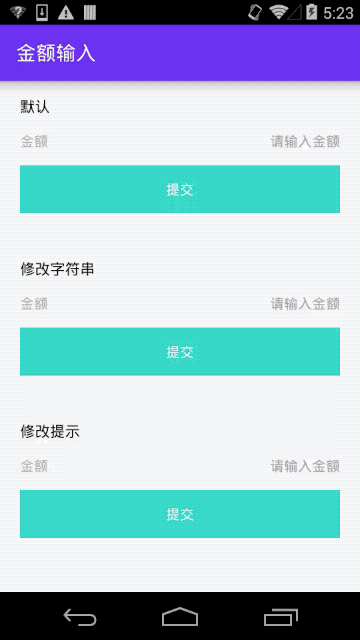

[TOC]

## 金额输入

### 博文：[android 【符号+金额】输入（右对齐）的一种简单实现](https://wufengxue.github.io/2020/03/24/android-money-input.html)

### [源码：MoneyInputActivity](https://github.com/WuFengXue/AndroidLabs/blob/master/app/src/main/java/com/reinhard/androidlabs/lab/MoneyInputActivity.java)

### 产品需求

* 无输入时，提示：请输入金额
* 有输入时显示：符号 + 金额（如：¥123）
* 要求右对齐
* 要求结果只返回数字部分

### 3种实现

* 默认：{@link TextView}（显示符号） + {@link EditText}（显示金额）
  * 结论：不满足需求：当输入内容宽度小于提示的宽度时，符号和金额会分离，如：¥&nbsp;&nbsp;&nbsp;&nbsp;&nbsp;123
* 修改字符串：{@link EditText}（同时显示符号和金额）
  * 在 {@link TextWatcher#afterTextChanged(Editable)} 回调中对字符进行修改然后再回写
  * 结论：可以满足需求，但光标可以切换到符号之前（可以禁止在符号之前输入数字）
* 修改提示：{@link TextView}（显示符号） + {@link EditText}（显示金额）
  * 在 {@link TextWatcher#afterTextChanged(Editable)} 回调中对提示进行修改
  * 结论：可以满足需求，且不存在光标切换问题

### 效果图

